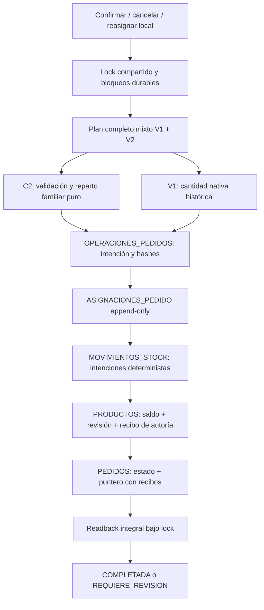

# Familias / SKU — C4 durable exclusivamente local

Fecha: 2026-10-07. Rama: `feature/fase-3a-operativa`.
HEAD inicial: `8b1d105b33659ce7468c92fc10413167922bc879`.
Estado: implementado y verificado con almacenamiento simulado; **sin integración ni deploy**.
El commit de entrega se obtiene con `git log -1 --format=%H -- docs/operativa/FAMILIAS_PRODUCTO_FASE_C4_DURABLE_LOCAL_2026-10-07.md`.

## 1. Arquitectura

`planMixtoV2.ts` compone la operación completa antes de escribir. Reutiliza C2 para cada operación familiar, sin modificar C1/C2. `adaptadorDurableV2.ts` solamente conoce una interfaz de almacenamiento. `almacenSheetsMemoriaV2.ts` implementa esa interfaz en memoria, con lock compartido, CAS, inyección de fallos y respuesta HTTP ambigua. Ninguno importa Google APIs, transportes, rutas o configuración remota.

## 2. Archivos de entrega

Nuevos:

- `src/lib/familias/planMixtoV2.ts`.
- `src/lib/familias/adaptadorDurableV2.ts`.
- `src/lib/familias/almacenSheetsMemoriaV2.ts`.
- `tests/fixtures/familias-durable-c4.mjs`.
- `tests/familias-durable-c4.test.mjs`.
- Este informe.

Modificados: `scripts/auditar-v1-familias.mjs` agrega `--no-write` para obtener evidencia por stdout sin escribir archivos ignorados. Documentos vivos: DATA_MODEL, DECISIONS, PROJECT_STATE, TASKS, TEST_PLAN y CHANGELOG.

Apps Script, setup, C1, C2, transportes, endpoints, UI, dependencias, configuración y secretos no se modificaron.

## 3. Orden de escrituras y puntos de fallo

| Orden | Efecto durable | Evidencia de recuperación |
|---|---|---|
| 1 | PREPARADA en OPERACIONES_PEDIDOS | Input/hash, pedido/detalles, stock antes/después, IDs y contexto congelados. |
| 2 | APLICANDO, paso 1 | Diario previo íntegro. |
| 3 | Asignaciones nuevas, una fila por SKU/detalle | ID estable y fila completa exacta; nunca editar la anterior. |
| 4 | Checkpoint 2 | Todas las asignaciones deben existir. |
| 5 | Movimientos, una fila por efecto | ID, referencia, payload_hash, detalle/asignaciones, delta y saldos encadenados. |
| 6 | Checkpoint 3 y verificación previa a stock | Todas las intenciones deben estar completas. |
| 7 | Una escritura CAS por SKU | Stock final, revisión y recibo de autoría se escriben juntos en la fila lógica. |
| 8 | Checkpoint 4 | Todos los SKU deben tener resultado y recibo exactos. |
| 9 | Estado del pedido; checkpoint 5 | Recibo de autoría específico del estado. |
| 10 | Puntero vigente; checkpoint 6 | Recibo específico del puntero. |
| 11 | Readback integral; checkpoint 7 | Segunda lectura integral antes del cierre. |
| 12 | COMPLETADA y resultado_json | Respuesta histórica estable. |

No se supone atomicidad entre hojas. El mock garantiza solamente la escritura lógica de una fila y un lock compartido. Un puerto real deberá acreditar cómo implementa esas garantías; si saldo/recibo quedan partidos, C4 exige revisión. No se presenta esta prueba como demostración de atomicidad de Google Sheets.

Los movimientos V2 son **intenciones pendientes** mientras el diario no esté COMPLETADA. No deben interpretarse como ventas/entradas consumadas en reportes futuros. La integración C5 deberá distinguirlas; los reportes V1 actuales permanecen intactos porque C4 no está conectado.

## 4. Modelo durable y operación incierta

OPERACIONES_PEDIDOS puede conservar sus columnas existentes: `tipo_operacion` agrega CONFIRMAR_V2, CANCELAR_V2 y REASIGNAR_V2 únicamente en el contrato local. `snapshot_json` contiene `modelo: PEDIDO_MIXTO_V2_1`, plan inmutable y `plan_hash`; `resultado_json` conserva respuesta final. `paso` registra etapas verificadas, sin sustituir la evidencia física. Operaciones V1 no se migran ni se reinterpretan.

El plan congela cabecera/detalles, actor/fecha, solicitud, oferta/precio/subtotal, contexto de apertura, familias observadas, política explícita si se inyectó, asignaciones antes/nuevas, reservas físicas V1, movimientos, saldos y revisiones. El diario constituye también auditoría de antes/después y de reasignación.

Una discrepancia conocida se persiste como REQUIERE_REVISION. Una caída/timeout se propaga y deja la última evidencia durable; no se borran movimientos, no se hace rollback especulativo ni se inventa progreso. La respuesta incierta informa el estado observado y no anuncia stocks/asignaciones previstas como aplicadas. El simulador permite eliminación CAS para compensaciones de pruebas, pero la orquestación comercial no borra historia.

## 5. Idempotencia y autoría

La key se busca antes de releer maestros. Hash canónico incluye tipo, pedido, actor, estado/apertura esperados y reparto ordenado. Mismo input/key: mismo plan/resultados. Otro input/key: 409. Timestamp y operación se conservan del primer plan; no se recalcula identidad en retry. ID de operación derivado de pedido/key; colisión o duplicado se rechaza. IDs de asignación/movimiento/recibo derivan de ese plan.

Un saldo igual al esperado **no demuestra autoría**. Para reconocer una escritura se exige fila exacta con `revision_stock_v2` y `evidencia_stock_v2`, que incluye operación, payload_hash, plan_hash y efecto_id. Ese hash enlaza los IDs/cantidades de movimientos y asignaciones; todas sus filas se verifican además por contenido y unicidad. PEDIDOS usa recibos separados para estado y puntero. Un puntero editado a otra operación histórica del mismo pedido se rechaza antes de cancelar/reasignar.

Estas evidencias son integridad/protocolo, no firmas criptográficas ni protección frente a una persona que falsifique deliberadamente todo el diario. Todos los futuros escritores deben respetar lock, bloqueo y revisión; modificaciones manuales externas, especialmente cambios que vuelven al mismo saldo sin registrar revisión, no pueden garantizarse con una simulación.

Una operación COMPLETADA devuelve resultado persistido aunque una operación legítima posterior haya cambiado stock/pedido. No recalcula resultados históricos contra stock actual. Resultado/diario corrupto pasa a revisión y bloqueo conservador.

## 6. Fault injection y HTTP

Se recrea la instancia del proceso conservando solamente el estado de las hojas/diario y se reintenta la misma key. Se comprueban saldos, unicidad, histórico y resultado único.

- Confirmación: 19 puntos, con caída y timeout en cada uno; 17 escrituras y los dos puntos de readback.
- Cancelación: 17 puntos; 15 escrituras y ambos puntos de readback.
- Reasignación: 21 puntos; 19 escrituras y ambos puntos de readback.
- Pedido mixto: 21 puntos, incluido tercer movimiento/stock.
- Granel: caídas en stock/readback/completada, timeout de cancelación y recuperación de reasignación para 100/250/1000.
- HTTP mock: respuesta perdida TIMEOUT/502 después de COMPLETADA y caída/timeout después de movimientos con diario APLICANDO.

Los doce puntos exigidos están cubiertos, además de checkpoints y cierre. En todos los casos recuperables: cero descuentos/devoluciones dobles y cero asignaciones/movimientos duplicados. Sin evidencia suficiente: revisión, nunca deducción por coincidencia de saldo.

## 7. Readback integral

`verificarOperacionV2()` comprueba identidad y hashes del diario/plan, detalle comercial intacto, cabecera y recibos, puntero, filas de asignaciones originales/nuevas, movimientos exactos y saldos/revisión/recibos de cada SKU. Detecta faltantes, duplicados, efectos inesperados y corrupción entre el primer readback y COMPLETADA. No completa ni corrige por sí mismo.

Los checkpoints hacen obligatoria la evidencia ya declarada. Una fila eliminada después de ese checkpoint no se recrea silenciosamente. Si hubo escritura de stock, se exige todo el conjunto de movimientos/asignaciones antes de continuar. El verificador del estado físico actual puede fallar para una operación antigua después de otra operación legítima; el replay histórico se obtiene de resultado_json.

## 8. Bloqueos y concurrencia

`obtenerBloqueosOperativos()` devuelve pedidos, SKU y operaciones pendientes en PREPARADA/APLICANDO/REQUIERE_REVISION. `exigirRecursosLibresV2()` es el guardrail futuro para confirmación, compra, venta, ajuste o reasignación. El recurso libre independiente puede avanzar. Diario corrupto/desconocido o V1 incompleto sin contrato interpretable: bloqueo global conservador, sin reconstruir recursos históricos.

Dos procesos comparten un lock global del almacenamiento. P1 termina antes de que P2 lea stock; P2 no calcula desde el saldo inicial de P1. Caída libera el lock transitorio, pero el diario sigue bloqueando los recursos. Doble clic con misma key crea una única operación.

El lock global elegido es deliberadamente simple. No se implementan leases, distribución entre servicios, endpoints de compra/venta/ajuste ni escritores remotos. C5 deberá probar que todos los escritores reales participan del mismo mecanismo.

## 9. Mixed V1/V2

Una misma cabecera puede contener V1 explícito o modelo vacío histórico más FAMILIA_V2 explícito. Se exige ID de detalle estable en fixtures; no se asignan IDs a históricos reales. Pedido completamente V1 queda fuera de C4, conservando su ruta vigente.

V1 conserva producto_id y cantidad nativa del detalle, precio/subtotal y snapshot GRANEL cuando exista. No interpreta cantidad V1 como gramos ni crea una familia artificial. La reserva física V1 queda en el plan; las filas ASIGNACIONES_PEDIDO corresponden a las líneas familiares. Todos los movimientos/saldos están en **un mismo plan**, y C2 ve stocks reducidos por V1 antes de validar V2.

Ejemplo: V1 PROD-X×2 más V2 A4+B2 produce tres movimientos y dos asignaciones familiares, una sola operación. SKU compartido con consumos 3+4 y stock6 falla globalmente antes de PREPARADA. Un fallo en cualquier línea impide completar el pedido; si una interrupción dejó efectos parciales, se mantiene bloqueado hasta reconciliación/revisión.

## 10. Cancelación durable

Recibido: sin asignaciones/movimientos/stock. Pendiente/listo: devuelve exactamente los SKU, cantidades y bases históricas, incluidas reservas V1. Activo, marca, familia, costo/precio actuales no deciden devoluciones. Cambio de base histórica o evidencia corrupta bloquea.

A4+B2 devuelve +4A/+2B, una sola vez. Cancelación no borra asignaciones; conserva puntero como referencia histórica, mientras estado cancelado indica que ya se devolvió. Entregado/cancelado no se reabren con una key nueva.

## 11. Reasignación durable

A4+B2→A1+B5 registra devolución y nueva asignación auditables, y escribe una sola vez el saldo neto por SKU: A3/B2. Las cuatro filas de movimientos describen la reversión/aplicación, pero no obligan a publicar saldos intermedios entre ellas. La operación anterior/asignaciones permanecen append-only; nuevas filas y nuevo puntero representan la distribución vigente.

V1 del pedido mixto se mantiene reservado; reasignar cambia únicamente las líneas familiares. Cancelar posteriormente revierte la nueva distribución y el V1 original. No hay edición directa de una asignación confirmada ni UI nueva.

## 12. Granel D40

La solicitud familiar usa gramos; el subtotal se conserva por línea. 150g a $1.350/kg = $203; asignar 75g+75g no recalcula subtotales de fragmentos. Stock nativo A se mueve 75/base; B 75/1000. Bases 100/250/1000 se convierten a enteros para validar y operar, sin sumar unidades nativas distintas. Cancelación restaura exactamente ambas bases y replay no acumula error.

Reasignación 25g+125g también conserva $203. Histórico V1 GRANEL sigue usando cantidad nativa congelada. No se activaron familias reales de granel ni se cambió D40.

## 13. Apertura y HUMAN_GATE

La apertura esperada debe coincidir con el ID del contexto congelado en PEDIDOS. Se consulta únicamente la habilitación actual simulada para ese ID; no se sustituye por la apertura más reciente. Siguiendo C2, POR_APERTURA debe continuar habilitado al confirmar. Si dejó de estarlo, se rechaza antes de preparar. Si cambia mientras existe plan, se detiene en revisión. Contexto/habilitación quedan congelados en el plan; cancelación utiliza histórico y no exige habilitación actual.

**HUMAN_GATE pendiente:** familia activa al pedir y desactivada antes de confirmar. Sin `resolverPoliticaFamiliaDesactivada`, resultado 423/HUMAN_GATE y cero escrituras. Las opciones inyectadas PERMITIR_SNAPSHOT y BLOQUEAR son mecanismos de prueba; ninguna se eligió como decisión comercial. Snapshot, precio y subtotal del pedido se conservan. Omar debe decidir esa política antes de integración operativa. Una desactivación después de PREPARADA requiere revisión y no cambia silenciosamente el plan.

## 14. QA y evidencia V1

Ejecutado localmente:

- C4: **176/176 PASS**.
- Suite completa: **824/824 PASS**, sin tests omitidos.
- Lint, typecheck, build completo con salida aislada, secret scan (337 archivos) y git diff --check: PASS.
- Build convencional: dos intentos compilaron y generaron 25 páginas, pero fallaron al retirar `.next/export` vacío con EBUSY dentro de Dropbox. La revisión automática bloqueó retirar ese directorio; no se retiró. QA se completó fuera de Dropbox, sin modificar next.config: el cargador de configuración de Next se envolvió solo en memoria para cambiar distDir y propagarlo a workers. Mismas opciones de lint/typecheck/optimización y 25 páginas completadas. La resolución de módulos usa una junction de QA en el padre de la salida, fuera del directorio limpiado por Next; no modifica node_modules original.
- Intentos aislados previos: herencia del comando inline causó procesos recursivos, detenidos únicamente por la firma de ese intento; después se corrigió execArgv. Dos fallos de preparación de la salida (resolución de tipos y distDir de workers) quedaron corregidos antes del build completo PASS. Inclusión de tipos añadida automáticamente por Next a tsconfig fue verificada/restaurada; tsconfig y next-env no forman parte del diff. URLs/tokens de backend vacíos para todos los builds; no se ejecutaron servicios remotos. Advertencia Windows useWasmBinary no bloqueante.
- Auditoría: `node --disable-warning=MODULE_TYPELESS_PACKAGE_JSON scripts/auditar-v1-familias.mjs --no-write`. 23 archivos V1,187 funciones GAS,47 acciones HTTP y51 funciones transporte preservados frente a f273001; los seis escenarios VM diferenciales son idénticos: pedido unitario, granel100/250/1000, compra legada/admin y venta presencial.
- C1/C2, GAS, setup y transporte: byte equivalentes normalizando CRLF frente al HEAD inicial C4. Ninguna ruta importa los nuevos módulos.

## 15. Límites y eventual C5 TEST

C4 demuestra la orquestación **bajo el contrato del mock**, no la durabilidad efectiva de un servicio Google. No hay migrador/deploy, nuevas hojas/columnas reales, ruta HTTP pública, tienda/cart/pedido familiar activo, UI de asignación, familias/SKU comerciales, costos/precios/stock reales, lotes/FIFO, escritor distribuido ni reconciliación humana automática. F10 sigue 1 READY/19 PENDING.

Próximo paso recomendado, con autorización separada:

1. Resolver HUMAN_GATE y revisar contrato de recibos/revisiones/lock de todos los escritores, y visibilidad de intenciones pendientes en reportes.
2. Implementar puerto TEST con esquema futuro serializado y datos sintéticos aislados; probar granularidad de escritura, readback y fallos parciales sin afirmar ACID.
3. Preparar destino exacto, backup completo verificable, plan aditivo/idempotente, rollback y restauración de fixtures. Nada de esto se ejecutó en C4.
4. Probar idempotencia/recovery y coexistencia V1/V2 de extremo a extremo antes de considerar migración comercial o activación pública.

Main, Production y Google Sheet productiva intactos. TEST Sheet intacta durante C4. Apps Script TEST mantiene v20 según cierre anterior; no se volvió a consultar ni desplegar. Sin deploy ni datos reales modificados. Solo commit/push de la rama autorizada.
