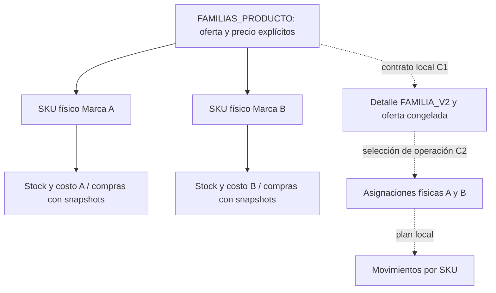

# Sesión familias / SKU — 2026-10-07

## Cierre y checkpoints

Rama exclusiva `feature/fase-3a-operativa`. HEAD inicial verificado `f2730011afd139bd61d69d4246086de486f5c872`. HEAD técnico final `fd7bd55df90e3ac0ce3c121aeb6fda9fc717f306`; el checkpoint documental C3 que contiene este informe es el HEAD final de cierre, identificado mediante `git log -1 --format=%H -- docs/operativa/SESION_LARGA_FAMILIAS_SKU_2026-10-07.md` y comunicado en la entrega. No se escribe un hash autorreferente imposible dentro de su propio commit.

| Fase | Commit | Resultado |
|---|---|---|
| B2 | `315817ef5139ecb842fb1d056b0dea7fa384a975` | Esquema TEST, backup/readback, repetición0 y backend v19 |
| B3 | `a81c6474920b9cf77b1c96ba2d3459cc88a9d6d2` | Backend admin TEST v20, identidad validada, UI exclusiva TEST, auditoría |
| C1 | `fe6231f1e8f02bb3a0b4d62fb516d748b71ac069` | Contrato V2 y asignaciones futuras, exclusivamente local |
| C2 | `fd7bd55df90e3ac0ce3c121aeb6fda9fc717f306` | Motor puro y 38 pruebas, exclusivamente local |
| C3 | Commit que contiene este informe | Auditoría integral, frontera API, QA y plan siguiente |

Cada checkpoint fue seguido por pruebas focales y push normal a la misma rama. No merge/rebase/force push. B2/B3/C1/C2 completos en su alcance técnico; C3 cierra la auditoría. Revisión visual humana y activación real pendientes por alcance, no por una fase fallida. F10 mantiene 1 READY/19 PENDING.

## Arquitectura y separación

Sin SKU virtual, stock/costo/proveedor de familia, lotes ni FIFO. Proveedor permanece en compra; cada SKU conserva inventario/costo. Catálogo/carrito/pedido/venta actuales siguen SKU_V1. Los contratos dueños están en [DATA_MODEL](../DATA_MODEL.md); decisiones D43–D48 en [DECISIONS](../DECISIONS.md).

## B2 — respaldo y esquema real TEST

Se comprobó ID `1U1nj_DKExmMV3pOA50JprcQ2d4TOQqb-4ORaJUagEoM` y nombre exacto `TEST - BD_WEB_ALMACEN_ROSA_ELENA_MORALES` antes de escribir. Encabezados completos, pestañas y 56 IDs sin duplicados; conteos y huellas originales capturados. [Acta completa B2](FAMILIAS_B2_TEST_2026-10-07.md).

Backup nativo completo [BACKUP TEST FAMILIAS B2 2026-10-07T07-02-23-673Z](https://docs.google.com/spreadsheets/d/1mNAkm8pMvsRPTx0pi-bQNAxcru_eT6JUYIHsh-VuP6Q/edit): 17 pestañas legibles, idénticas en valores/fórmulas. Se volvió a leer el original antes de migrar. Un único batch atómico con cuatro requests: cinco headers SKU, seis snapshots de compra y hoja/headers familiares. Segunda ejecución 0 cambios, sin otro backup. Nuevas columnas vacías en todas las filas; ninguna identidad histórica reconstruida. Formato/validaciones vecinos verificados mediante CellData; no se afirma revisión visual humana de Sheet.

Apps Script TEST v18→v19, destino/proyecto/deployment existentes comprobados. Código anterior y manifest privados conservados, versión inmutable v18 disponible. Post-deploy exclusivamente GET de destino, esquema, maestro, catálogo, compras/detalles y guardrails/capacidades existentes; no operaciones comerciales.

## B3 — administración y auditoría

Acciones nuevas listar/obtener/crear/actualizar familias y auditarMapaFamiliasSku: token interno, APP_ENV TEST, ID/nombre exactos para familias; Next exige sesión con productos:gestionar. Las rutas y navegación nuevas no se habilitan fuera de TEST. No se crean usuarios ni cambian roles.

Familia: ID inmutable, precio explícito, activo SI/NO, creación v1 y edición con versión esperada. Se incrementa versión ante cambios comerciales y se comprueba que los SKU asociados sigan siendo equivalentes. SKU: familia existente/única, contenido/modo/categoría/marca compatibles y sin inferencias por nombre. Sin familia sigue V1. Asociación/desasociación conserva stock/costo/precio.

UI /admin/familias: Oferta pública, Identidad física y dry-run separados. Marca/presentación se editan en el SKU, nunca manualmente en compras. Validadores/DTOs bloquean stock/costo/precio por el endpoint de identidad; actor procede de sesión, no del navegador. UI compilada; revisión visual por Omar pendiente. No se ejecutaron sus formularios contra datos reales.

Auditoría añade cuatro headers al final de AUDITORIA_PRODUCTOS: entidad_tipo, entidad_id, payload_hash, resultado_json. Familia usa entidad FAMILIA y producto_id vacío; históricos vacíos mantienen significado SKU y los reportes de productos excluyen eventos de familia. Diario PREPARADA/COMPLETADA congela antes/después y resultado; retry devuelve resultado original, conflicto409 si cambia entrada. Errores controlados compensan fila/audit; interrupción abrupta bloquea entidad para revisión.

Antes del cambio estructural B3, backup completo [BACKUP TEST FAMILIAS B3 2026-10-07T07-20-33-123Z](https://docs.google.com/spreadsheets/d/16-_4Kesg_6nmHS9P2n_ta1-xFAymUVixlIvZorA9RIk/edit): 18 pestañas legibles/idénticas. Un request, readback íntegro y segunda ejecución0. Apps Script TEST v19→v20, backup privado de v19 y manifest. [Acta B3](FAMILIAS_B3_TEST_2026-10-07.md).

Post-deploy: catálogo V1 conserva SHA256 `23c00f8584db2c96fcabe7f28d32bcaae183f7c15846b2885b31b5c55502c9e4`; tres compras/detalles legibles; familias0 y auditoría del mapa válida/vacía. Sin pedidos, compras, ventas ni ajustes nuevos.

## Esquema TEST final

| Hoja | Columnas usadas | Filas de datos | Cambio de sesión |
|---|---:|---:|---|
| PRODUCTOS | 25 | 56 | +5 headers, datos nuevos vacíos |
| DETALLE_COMPRAS | 24 | 4 | +6 snapshots vacíos |
| FAMILIAS_PRODUCTO | 18 | 0 | Hoja nueva sin familias/fixtures |
| AUDITORIA_PRODUCTOS | 11 | 72 | +4 headers, sin eventos nuevos |
| COMPRAS | 14 | 3 | Intacta |
| PEDIDOS | 15 | 23 | Intacta |
| DETALLE_PEDIDOS | 11 | 27 | Intacta, sin columnas V2 |
| VENTAS / DETALLE_VENTAS | 17 / 14 | 24 / 24 | Intactas |
| MOVIMIENTOS_STOCK | 20 | 72 | Intacta |
| HISTORIAL_COSTOS | 9 | 34 | Intacta |

18 pestañas finales; ASIGNACIONES_PEDIDO no existe. Lectura final comparó exactamente **5.074 celdas originales** (17 pestañas iniciales), además de comparar íntegramente el estado posterior a B3: ninguna diferencia. IDs/stock/costo/precio/modo/referencias/bases y demás celdas históricas conservados. Identidad SKU, snapshots compra y campos nuevos de auditoría vacíos; familias0. Backup estructural completo recuperable, no solo export de headers.

## C1 — pedido paralelo local

Línea modelo explícito: SKU_V1 histórico vacío conserva ID físico y cantidad nativa; FAMILIA_V2 guarda solicitud comercial/familia y deja ID físico/cantidad nativa vacíos. Snapshot completo de oferta congela contenido/política de marca/precio/presentación/versión/referencia, además de nombre/precio/subtotal. Campos aportados por navegador no fijan precio.

ASIGNACIONES_PEDIDO futura relaciona detalle con uno o varios SKU, cantidad solicitada versus stock nativo y snapshots físicos auditados. No hoja real, setup ejecutado, rutas nuevas de pedidos ni importación de este dominio desde transporte/GAS/tienda. Puntero futuro operacion_asignacion_vigente permite conservar todas las asignaciones históricas ante reasignación.

## C2 — motor puro local

Cloro Económico pedido6, A stock4/B stock7: operación decide A4+B2, resultado A0/B5. Familia precio650, costos A590/B610 permanecen independientes. No selección automática ni descuento de una familia.

Se rechazan familia/marca/presentación incompatibles, inactividad, falta de habilitación, duplicados, suma incompleta/excedida, stock insuficiente, bases inválidas, NaN/desborde y líneas ajenas. Varias líneas que comparten SKU se comprueban sobre saldo acumulado. Identidad/base cambiada después del plan bloquea progreso.

Plan PREPARADA/APLICANDO/COMPLETADA/REQUIERE_REVISION congela pedido/estados, líneas, asignaciones, contexto, stocks, IDs, actor y hashes SHA256. Replay del mismo reparto/key usa plan original; diferente reparto409. Cursor atrasado con movimiento/saldo comprobables se reconcilia; stock sin movimiento o evidencia incoherente exige revisión. No se adivina ni se vuelve a descontar.

Cancelación de recibido no mueve stock. Confirmado devuelve exactamente A4/B2 desde snapshots, incluso SKU hoy inactivo o reasociado; entregado no cancela. Reasignación revierte explícitamente el reparto anterior, valida/aplica uno nuevo y audita antes/después; históricos quedan congelados. No edición directa de asignación confirmada.

GRANEL conserva D40: solicitado150g a1350/kg subtotal203, asignado75g+75g conserva203. Solo stock se convierte por cada base100/250/1000. No suma nativa6 ni redondeo comercial por fragmento. Familias granel reales siguen sin migrar/activar.

## QA y evidencia V1

| Verificación | Resultado |
|---|---|
| B2 focal / deploy guardrails | 5 + 6 PASS |
| B3 focal | 15 PASS |
| C1 focal | 13 PASS |
| C2 focal | 38 PASS |
| C3 frontera API con transportes mock | 10 PASS |
| npm test final | **648/648 PASS**, sin omitidas |
| lint | PASS sin warnings |
| typecheck | PASS, incremental deshabilitado |
| build local sin destinos backend | PASS,25 páginas |
| scan secrets / git diff --check | PASS |
| Generador TS/GAS | PASS, contrato vigente |
| Lecturas TEST posteriores | PASS, solo GET, familias0 |

Un build B3 terminó EBUSY en .next dentro de Dropbox tras compilar; reintento aprobado. Warning existente useWasmBinary en Windows no bloqueante. No cambios de secretos/dependencias. Build final aprobado después de C2; C3 agrega solo auditoría/tests/documentación y no cambia aplicación.

`node --disable-warning=MODULE_TYPELESS_PACKAGE_JSON scripts/auditar-v1-familias.mjs` comprueba contra HEAD inicial: 23 archivos V1 idénticos,187 funciones GAS idénticas,47 acciones HTTP existentes intactas y51 funciones de transporte conservadas. Solo cambian wrappers GET/POST para agregar admin, validación familiar en dos funciones admin y exclusión de eventos familiares del reporte SKU. V1 legado no requiere familia.

Seis comparaciones diferenciales en VM usando la fuente inicial y final dan resultados/hojas iguales: catálogo/pedido/confirmación/cancelación/replay UNIDAD; GRANEL bases100/250/1000; compra legado+admin; venta presencial GRANEL. Nunca llamaron servicios. Tienda/carrito y rutas públicas no tienen diff. Suite cubre idempotencia, rollback, snapshots, stock y D40 originales además de fases nuevas.

Evidencia privada ignorada: operativa.local/familias-test-readonly.json y auditoria-v1-familias.json; respaldos Apps Script v18/v19 en operativa.local/backups. No publicar tokens, URLs privadas ni registros de clientes/configuración.

## Archivos de la sesión

- Dominio: src/lib/familiasProducto.ts, familiasAdmin.ts, familias/pedidoV2.ts, familias/asignacionV2.ts.
- Integración admin: src/lib/appsScriptPedidos.ts (funciones nuevas), fase9/autorizacion.ts, src/app/api/admin/familias/route.ts e identidad/route.ts.
- UI TEST: src/app/admin/familias/page.tsx, src/components/admin/FamiliasAdmin.tsx y AdminFase78Nav.tsx.
- Scripts: apps-script-pedidos.gs, deploy-apps-script-test.ps1, verificar-familias-test.mjs, lib/familias-b2.mjs, lib/familias-b3.mjs, auditar-v1-familias.mjs.
- Pruebas: familias-b2.test.mjs, familias-producto-fase-b3.test.mjs, pedido-familia-c1.test.mjs, asignacion-familia-c2.test.mjs, familias-admin-frontera-c3.test.mjs. Fase A ajusta su antigua prohibición de acciones familiares para permitir admin B3 y seguir comprobando catálogo V1 separado.
- Documentación: DATA_MODEL, DECISIONS, PROJECT_STATE, TASKS, TEST_PLAN, CHANGELOG y actas B2/B3/esta sesión.

## Riesgos y HUMAN_GATES

1. **HUMAN_GATE — mapa comercial físico:** Omar debe acreditar marca/contenido/familia por SKU antes de cargar cualquier identidad real. Especialmente equivalencia de variedades/orígenes granel; no inferir desde nombre ni reconstruir compras antiguas.
2. **HUMAN_GATE — revisión visual/funcional:** revisar UI nueva y experiencia resultante en TEST/Preview. No se promueve F10 ni se afirma validación humana por compilar/testear.
3. **HUMAN_GATE — oferta desactivada con pedido recibido:** definir si operación puede cumplir la oferta congelada o debe detener ese pedido cuando la familia se desactiva después. Motor local conserva snapshot y valida SKU vigentes; no se inventó una política nueva de intervención pública. Resolver antes de conectar confirmación real.

Riesgo técnico pendiente: memoria no demuestra atomicidad de varias escrituras Sheets. Adaptador futuro debe persistir diario/intento antes de efectos, bloquear pedido/SKU con operación incompleta, validar bajo lock y reconciliar movimientos/saldos/filas mediante readback. No asumir que igualdad de saldo prueba la autoría de una escritura parcial. Una base histórica cambiada exige revisión/migración aparte. Pedidos mixtos V1/V2 quedan fuera del motor local actual y requieren extensión explícita; nunca reinterpretar V1 como V2.

## No implementado/desplegado y próximo paso exacto

C1/C2 no desplegados ni importados por GAS/rutas actuales. No catálogo/carrito público familiar, aceptación pública V2, confirmación/cancelación/venta reales por familia, hoja ASIGNACIONES_PEDIDO, datos comerciales nuevos, conteo físico, lotes/FIFO, fotos, costos reales, caja/cuentas/usuarios ni capacitación. Backend TEST vigente solo B3 v20. Ningún deploy Next/Production manual; pushes exclusivos de la rama feature.

**Próxima tarea técnica C4:** construir adaptador durable V2 exclusivamente local con mocks de Sheets: diario de operación, puntero de asignación vigente, filas históricas append-only, lock y bloqueo por SKU/pedido pendiente; pruebas de interrupción después de cada escritura, rollback/reconciliación y replay HTTP ambiguo. Mantener rutas públicas apagadas. Después, autorización independiente para migración/deploy TEST con backup/readback y fixtures aislados, antes de cualquier activación/carga comercial. Resolver HUMAN_GATES aplicables.

## Rollback y guardrails finales

Rollback backend TEST: versiones inmutables v19 (antes B3) y v18 (antes B2); código/manifest privados legibles. Backups nativos B2/B3 recuperables. Columnas/hoja vacías son compatibles con V1; preferir conservar estructura aditiva y revertir deployment antes que borrar/restaurar datos. Recuperación de Sheet debe ser supervisada y partir de comparación con backup, jamás sobrescribir stock/precios por suposición. Rollback local por commits separados, sin rebase/force push.

main local y remoto comprobados en `f203e0c1f1d74ffd9e826032a8c0a60df4ce6c3f`, sin modificaciones. Production, Apps Script productivo y Google Sheet productiva intactos. Solo TEST modificado estructuralmente en lo autorizado. Cero valores comerciales/stock/costos/precios/IDs reales modificados, cero familias reales cargadas y cero deploy C1/C2.
